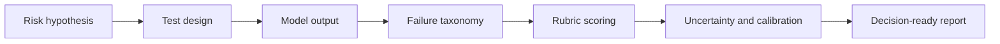
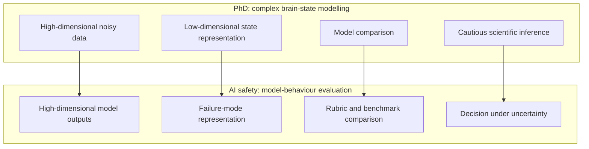

# Faculty AI Safety Portfolio Map

## Positioning

This repository demonstrates my strongest fit for AI safety research roles:

> Designing rigorous evaluations for complex model behaviour: defining what failure means, building defensible tests, stress-testing outputs, and translating uncertainty into decisions.

The aim is not to present generic prompt engineering. The aim is to show evaluation methodology: how vague concerns about model risk become measurable protocols, rubrics, failure taxonomies, uncertainty estimates, and decision-ready reports.

---

## Why this matters for AI safety

AI safety evaluations are only useful if they are explicit about:

1. **Risk hypothesis** — what failure are we trying to detect?
2. **Task design** — what prompt or scenario should expose it?
3. **Failure definition** — what counts as unsafe, wrong, misleading, overconfident, or unsupported?
4. **Scoring rubric** — how do we score quality and severity reproducibly?
5. **Uncertainty** — how confident are we in the score and evaluator agreement?
6. **Decision threshold** — what action follows: pass, monitor, investigate, block, or redesign?

---

## Portfolio modules

### 1. Failure-mode analysis of scientific reasoning

Purpose: evaluate whether models can reason correctly under uncertainty rather than producing plausible but invalid scientific claims.

Signals demonstrated:

- adversarial STEM task design;
- rubric-based scoring;
- failure mode classification;
- distinction between plausible answer and defensible reasoning;
- severity-aware reporting.

### 2. RAG grounding and claim-level factuality

Purpose: evaluate whether generated answers are actually supported by supplied evidence.

Signals demonstrated:

- atomic claim extraction;
- support / contradiction / not-found labels;
- hallucination and citation-risk analysis;
- stakeholder-readable grounding report.

### 3. Rubric calibration and evaluator agreement

Purpose: demonstrate that evaluation is not reliable unless scoring criteria are reproducible.

Signals demonstrated:

- multi-dimensional rubrics;
- evaluator disagreement analysis;
- calibration thresholds;
- pass / review / fail decision zones.

### 4. Complex systems validation bridge

Purpose: connect my PhD research discipline to AI safety evaluation without overclaiming that brains and LLMs are the same.

The methodological bridge is:

The shared discipline is validation: asking whether the representation actually supports the claim being made.

---

## What this repository should prove to Faculty

- I can translate ambiguous safety questions into measurable tests.
- I can define failure modes clearly rather than relying on vague benchmark scores.
- I can design structured rubrics and severity scales.
- I can analyse uncertainty, disagreement, and robustness.
- I can communicate evaluation results to researchers, engineers, product teams, and senior stakeholders.

---

## Interview sentence

> I built this portfolio around evaluation methodology rather than generic demos. The central idea is how to make model behaviour measurable: define failures, design stress tests, score outputs with rubrics, analyse uncertainty, and turn that into decisions. That is the same discipline I used in my PhD, where the key question was always whether the model actually supported the scientific claim.
